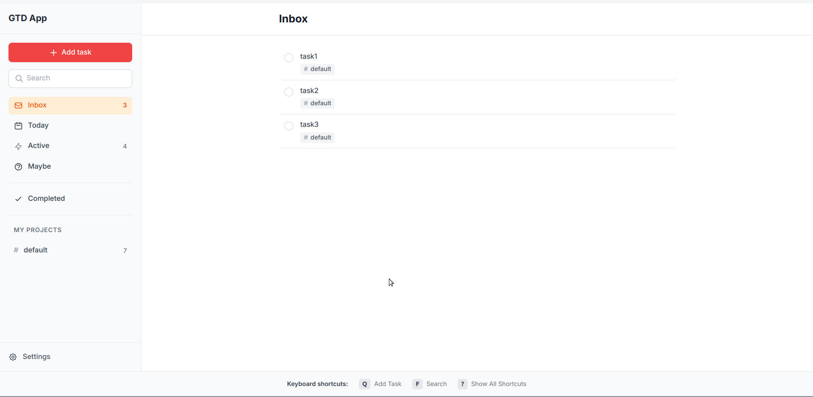
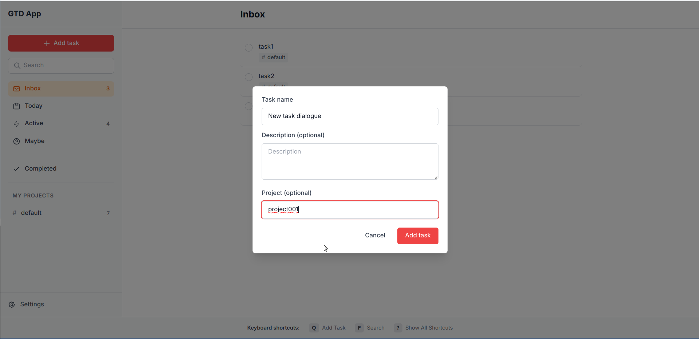
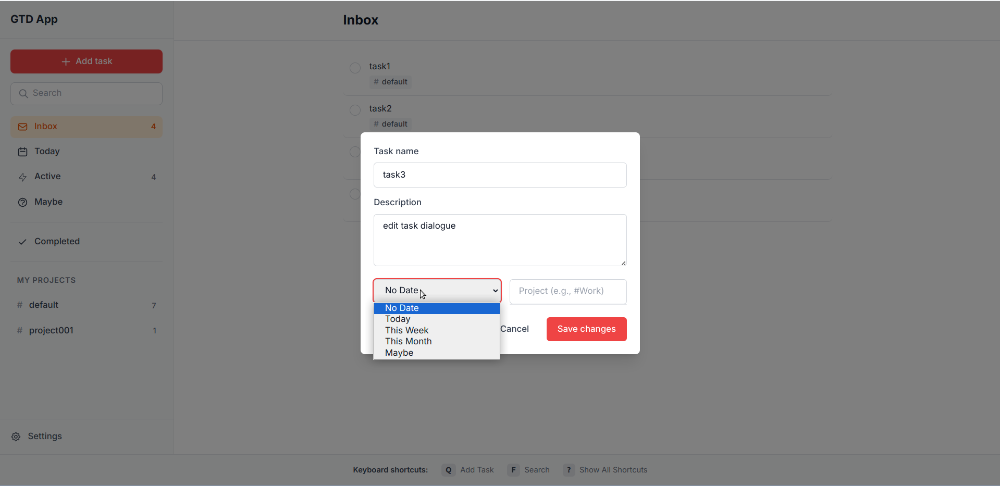
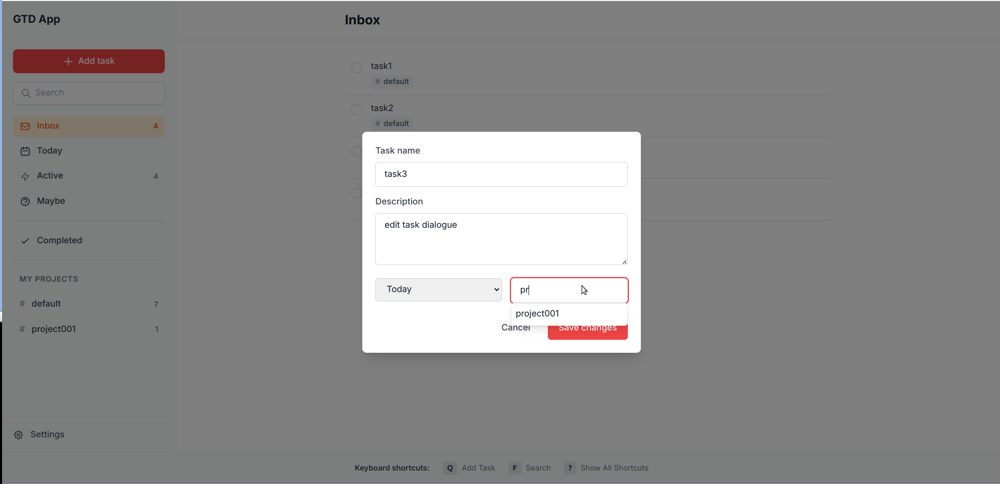

# GTD Web

A web-based Getting Things Done (GTD) task management application built with FastHTML. The UI is inspired by todoist.com and provides a clean, intuitive interface for managing tasks, projects, and workflows.

## Installation

### Prerequisites

- Python 3.10 or higher

### Setup

1. Clone the repository:
```bash
git clone <repository-url>
cd gtd-web
```

2. Create and activate a virtual environment:
```bash
python -m venv venv
source venv/bin/activate  # On Windows: venv\Scripts\activate
```

3. Install dependencies:
```bash
pip install -r requirements.txt
```

4. Run the application:
```bash
python main.py
```

The application will be available at `http://localhost:5001`

## Features

- **Task Management**: Create, edit, and complete tasks
- **Projects**: Organize tasks into projects with hashtag-based tagging
- **Multiple Views**: 
  - Inbox for new tasks
  - Today view for daily tasks
  - Active tasks for ongoing work
  - Maybe list for future considerations
  - Completed tasks archive
- **Smart Scheduling**: Set tasks for today, this week, this month, or maybe
- **Project Autocomplete**: Quick project selection with autocomplete
- **Clean UI**: Todoist-inspired interface with smooth interactions
- **Real-time Updates**: HTMX-powered dynamic content updates

## Screenshots

### Main Interface

The clean, todoist-inspired main interface with sidebar navigation and task list

### Creating New Tasks

Quick task creation modal with title, description, and project assignment

### Editing Tasks - Schedule

Task editing modal showing schedule options (Today, This Week, This Month, Maybe)

### Editing Tasks - Projects  

Project assignment with autocomplete suggestions for quick project tagging

## Usage

### Adding Tasks

**Keyboard Shortcut**: Press `q` anywhere in the app to quickly open the new task modal.

1. Click the "Add task" button in the sidebar or press `q`
2. Enter a task name and optional description
3. Assign to a project (or leave as "default")
4. Click "Add task" to create

### Managing Tasks

- **Complete**: Click the checkbox next to a task
- **Edit**: Click anywhere on a task to open the edit modal
- **Schedule**: Use the edit modal to set tasks for today, week, month, or maybe
- **Projects**: Assign tasks to projects using #project-name format

### Navigation

Use the sidebar to switch between:
- **Inbox**: New, unprocessed tasks
- **Today**: Tasks scheduled for today
- **Active**: Currently in-progress tasks
- **Maybe**: Tasks for future consideration
- **Completed**: Finished tasks
- **Projects**: Filter by specific project

## Tech Stack

- **Backend**: FastHTML (Python)
- **Database**: SQLite with SQLModel
- **Frontend**: HTMX for dynamic interactions
- **Validation**: Pydantic for data models
- **Styling**: Tailwind CSS classes

## Project Structure

```
gtd-web/
├── main.py              # Main application and routes
├── storage_interface.py # Abstract storage interface
├── in_memory_storage.py # In-memory storage implementation
├── sqlite_storage.py    # SQLite storage implementation
├── main_page.html       # Main HTML template
├── requirements.txt     # Python dependencies
└── README.md           # This file
```

## Architecture

The application follows a clean architecture pattern:

- **Storage Interface**: Abstract `IStorage` interface defines the contract for task storage
- **Implementations**: Both in-memory and SQLite storage implementations
- **Routes**: FastHTML route handlers for HTTP endpoints
- **Components**: Modular functions for rendering UI elements
- **Models**: Pydantic models for data validation

## Development

### Running in Development

The same installation steps apply for development. The application runs in development mode with `python main.py`.

### Database

The application uses SQLite by default. The database file will be created automatically on first run.

### Adding Features

- Add new routes in `main.py`
- Extend storage implementations as needed
- Follow the existing component pattern for UI elements

## License

This project is open source under MIT license. Read LICENSE file for more details

## Contributing

Contributions are welcome! Please feel free to submit a Pull Request.

## Acknowledgments

This project was designed and developed with assistance from AI language models:

- **Gemini**: For architectural guidance, code design patterns, and feature implementation
- **Opencode**: For rapid prototyping, code optimization, and debugging assistance

The AI tools helped accelerate development while maintaining code quality and following best practices.